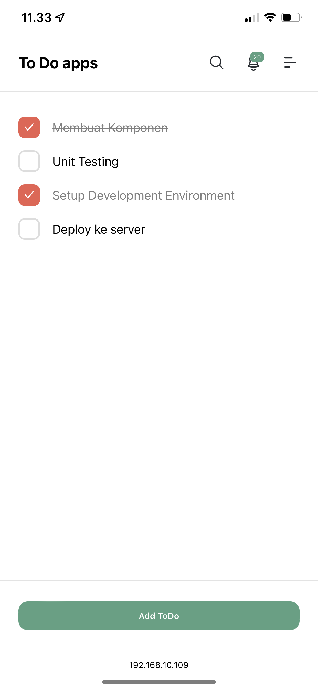

# HAI

ini rangkuman dari kita yang kemarin di tanggal 17-03-2022

Disini kita mempelajari beberapa tool selain menggunakan `npx create-react-app` yaitu menggunakan `vite` 

### APA Itu Vite?

vite adalah module bundler, `create-react-app` sendiri sudah membawa module bundlernya sendiri, yaitu `webpack` tetapi dikarenakan ukuran yang terlalu besar, mentor disini memberikan arahan untuk temen" bisa pakai selain dari `create-react-app` 

Selain `vite` masih banyak tools lain untuk membundler aplikasi javascript, contohnya ada 
- rollup
- gulp
- parcel
- snowpack
- esbuild (core dare vite)
- dll

untuk lebih jelasnya, temen" bisa pelajari sendiri.

### SCREENSHOT APP

